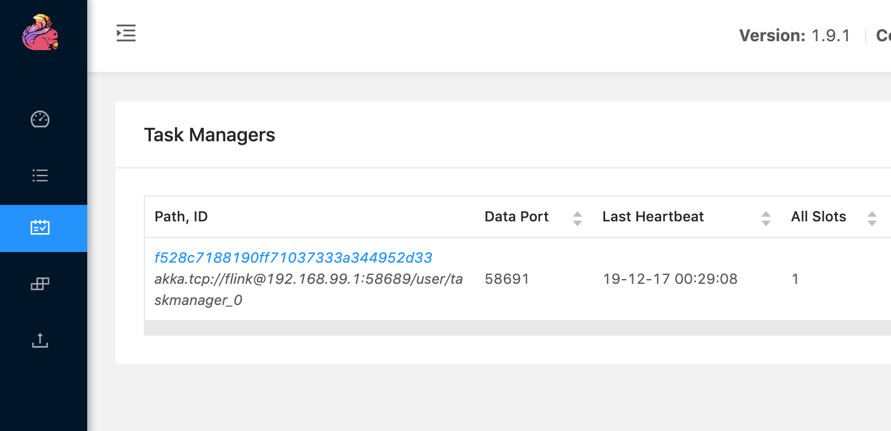
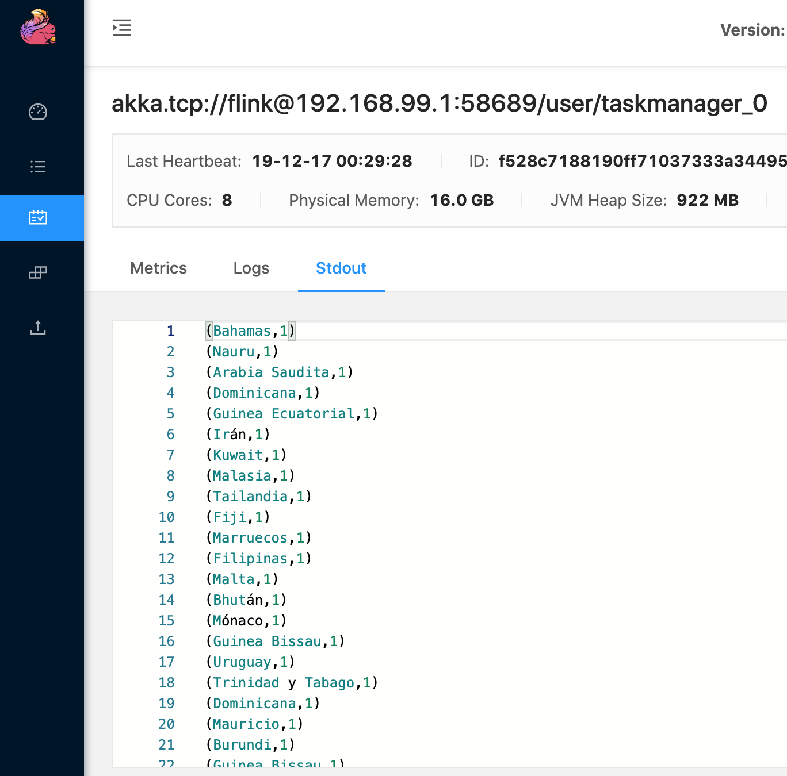
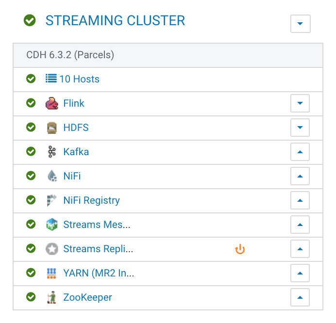
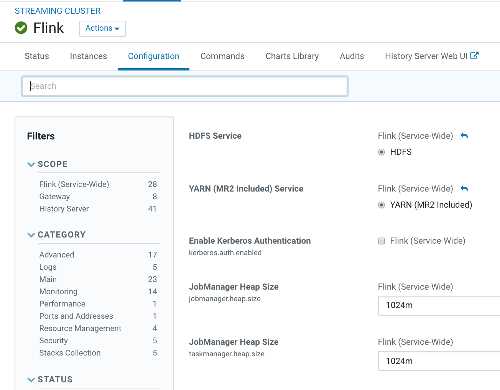

# Flink sample with Kafka
## Starting the project
### Requirements to compile
* MVN
* Java
### Requirements to Test
* Flink
* Kafka
### Create the project in MAVEN
This is only if you want to create new code. I started with the following. 
```bash
mvn archetype:generate                               \
     -DarchetypeGroupId=org.apache.flink              \
     -DarchetypeArtifactId=flink-quickstart-java      \
     -DarchetypeVersion=1.9.0
```
### Compile the Flink Job
```bash
mvn clean package
```

### Run the Flink Job
Please, go to the target folder, you will see the result of the compilation: webtraffic-by-country-1.0-SNAPSHOT.jar.
To test it, you need Kafka, in my case is running a cluster of 3 brokers with a Zookeeper on another 3 nodes. Topic is WebTraffic.
```bash
flink run webtraffic-by-country-1.0-SNAPSHOT.jar --topic WebTraffic --bootstrap.servers hgalante-cdf-5.gce.cloudera.com:9092,hgalante-cdf-6.gce.cloudera.com:9092,hgalante-cdf-7.gce.cloudera.com:9092 --group.id Flink --timeWindow 15 --zookeeper.servers hgalante-cdf-2.gce.cloudera.com:2181,hgalante-cdf-3.gce.cloudera.com:2181,hgalante-cdf-4.gce.cloudera.com:2181
```
To see the results, just go to the Task manager/ Click on the task manager and go to the Stdout window to the see the results.





# How to install Flink
## Apache Flink
if you have a mac, with brew you can install it as easy as:
```bash
brew install flink
```
If you point to http://localhost:8081 you will access to the Flink Web Dashboard

## Flink on Cloudera
if you are using a Cloudera cluster, you will need YARN and YARN required HDFS. After installing that, you need the Flink parcel from the URL's provided by [Cloudera Downloads](https://www.cloudera.com/downloads) on the DataFlow section. 
After restarting Cloudera Manager, you will have the Service, and you can deploy it over that Cluster. 

### Flink Service


### Flink Configuration


### Flink Role Distribution

